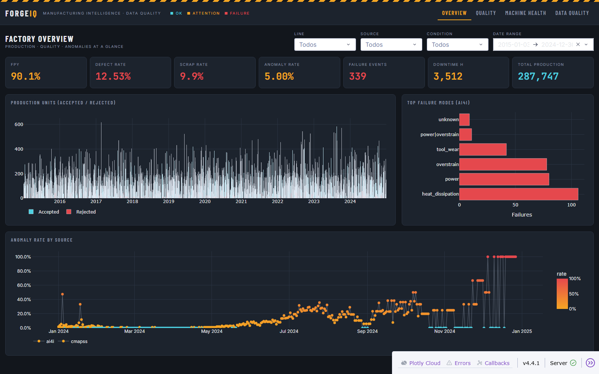
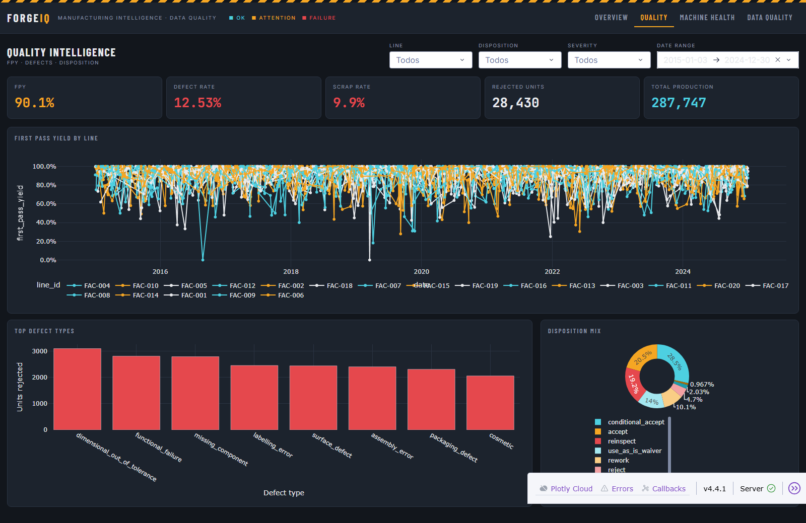
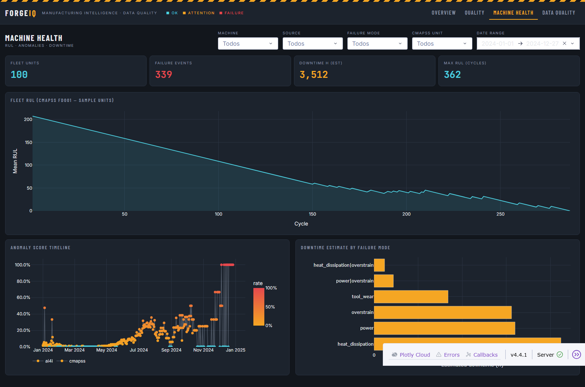
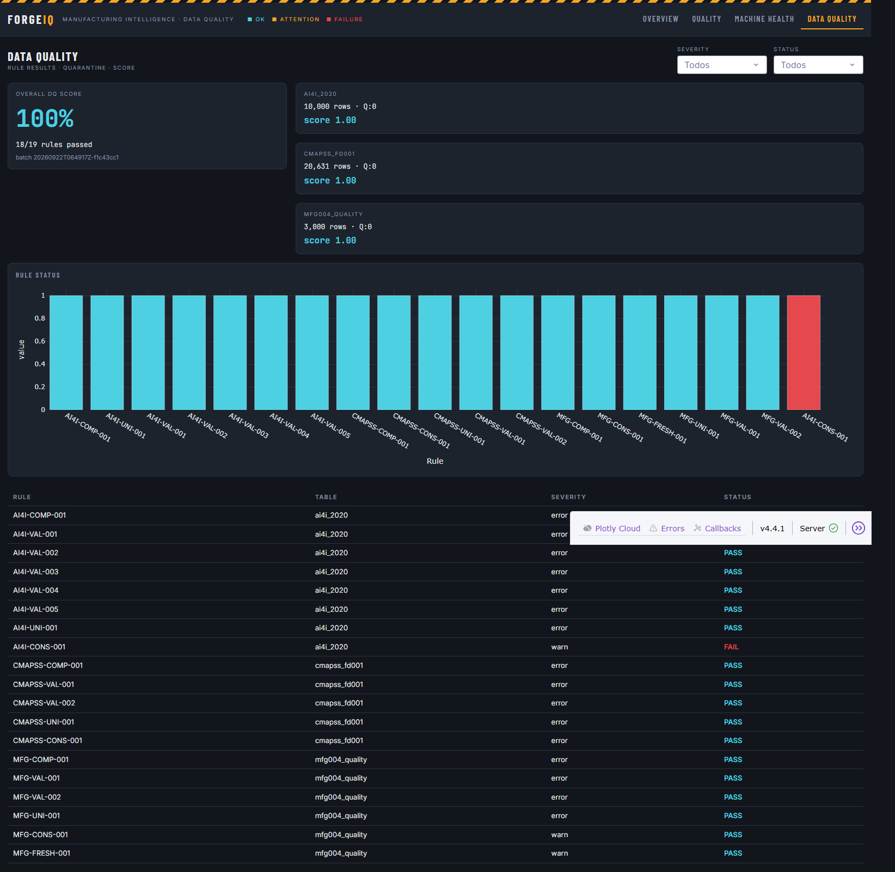

# ForgeIQ — Manufacturing Operations Intelligence Console

Single decision surface for production quality, machine reliability, and data trust across the plant.

## Executive Summary

ForgeIQ is the analytics product the operations and data teams use to answer three questions without opening a notebook: is the line producing within yield targets, which machines are about to cost us uptime, and can the data behind those numbers be trusted. It consolidates sensor, production, maintenance, and inspection signals into one console with KPIs, trend and segment analysis, anomaly scoring, and an explicit data-quality score. It supports daily production reviews, quality containment decisions, maintenance prioritization, and release/hold calls on quarantined data. Domain: discrete manufacturing operations.

## Dashboard Preview

**Factory Overview** — yield, reliability, and anomaly KPIs with production trend and top failure modes.



**Quality Intelligence** — FPY, defect and scrap rates, disposition mix, and defect Pareto by line.



**Machine Health** — fleet RUL, failure events, downtime, and sensor anomaly behavior per machine.



**Data Quality** — overall DQ score, rule results, and quarantined tables by severity and status.



## Problem Framing

Manufacturing signals arrive from three disconnected worlds: sensor streams (AI4I, CMAPSS), inspection records (FPY, scrap, defects), and maintenance logs. Each uses its own grain, identifiers, and quality level, so questions that should take seconds — which line is dragging yield, which machine failed most this month, is this KPI computed on clean data — required manual joins and tribal knowledge.

At scale the failure mode changes: raw records mix incompatible machine and product keys, defective rows silently poison aggregates, and anomaly signals never sit next to the KPIs they explain. Before ForgeIQ there was no shared model, no quarantine for bad rows, and no single place where quality, reliability, and data-trust were visible in the same view.

## Key Metrics (KPI Layer)

**Yield and quality (decide containment and customer exposure)**

- **FPY (First Pass Yield)** — share of inspected units accepted without rework. Directly sets the rework budget and flags which line to hold for inspection. Drop below target = contain the lot and escalate to process engineering.
- **Defect rate** — defects found per unit inspected. Trending up while volume is flat signals process drift; informs tooling and parameter reviews.
- **Scrap rate** — rejected units per inspected unit. Converts quality into material loss; drives cost conversations with plant management.
- **Rejected units** — absolute volume of scrap. Scales the problem: a stable rate on rising volume is still more loss to investigate.

**Reliability (decide maintenance priority)**

- **Failure events** — count of recorded failures in the window. Ranks machines for preventive maintenance scheduling.
- **Downtime hours (est.)** — estimated production hours lost. Translates failures into capacity impact and justifies maintenance slots.
- **Max RUL (cycles)** — highest remaining useful life across fleet units (CMAPSS). Identifies which units have headroom before intervention is mandatory.

**Detection and trust (decide whether to act on the numbers)**

- **Anomaly rate** — share of sensor readings flagged by the scoring model. Early signal of sensor or process deviation before failures appear in the log.
- **Data Quality score** — weighted pass rate of validation rules on the current pipeline output. When it degrades, KPIs above are provisional; the decision becomes "fix the feed, not the line."
- **Total production** — inspected volume in the window. Denominator context: rates without volume hide exposure.

## Analytical Layer (Dashboard Intelligence)

Questions the console answers on arrival:

- **Trend** — is yield degrading week over week, or is today an outlier? Are anomalies rising ahead of failures?
- **Comparative** — which line, source, or machine is the drag? Top failure modes and defect Pareto rank the few causes behind most losses.
- **Distribution** — how skewed is daily output and rejection volume; are there days far outside the normal band worth a root-cause look.
- **Behavioral signals** — anomaly scores and RUL trajectories expose units drifting toward failure while they are still running.
- **Trust** — rule results and quarantine counts show which tables, severities, and statuses are dirty before a number is quoted in a meeting.

## User Interaction Model

**Filters (page-scoped, applied live)**

- Overview: line, data source, condition (anomaly/normal), date range
- Quality: line, disposition, severity, date range
- Machine Health: machine, source, failure mode, CMAPSS unit, date range
- Data Quality: rule severity, rule status

**Dynamic updates** — every KPI tile, chart, and table re-aggregates on filter change; no manual refresh, no stale numbers in the room.

**Drill-down path** — plant KPI → segment (line/machine/source) → time window → underlying defect, failure, or quarantined record. Each step narrows from "what happened" to "who owns the fix." Interaction exists to cut time-to-decision: the filter set is the same vocabulary the operations team already uses in shift reviews.

## Data & Methodology

**Structure** — three public manufacturing sources unified into one fictional factory model (provenance preserved): AI4I 2020 (sensor + failure records), NASA CMAPSS FD001 (fleet degradation), MFG-004 (inspection/quality). Modeled as facts (`fact_production`, `fact_quality`, `fact_maintenance`, `fact_anomaly`, `kpi_summary`) and dimensions (`dim_line`, `dim_machine`, `dim_product`, `dim_date`) in a Gold layer of Parquet tables.

**Preprocessing** — ingestion lands raw files in Bronze; Silver performs entity resolution so disparate sources address the same machines, lines, and products. Dates are normalized, units aligned, and keys conformed before aggregation.

**Quality gates** — Pandera schemas and custom rules run before Silver. Failing rows are quarantined with structured reports (rule, severity, status) that feed the Data Quality page; clean rows continue downstream. KPIs are computed only on rows that cleared the gate.

**Aggregation** — Gold models pre-aggregate to day × line grain for production and quality, event grain for maintenance and anomalies, so the dashboard reads summaries, not raw scans.

**Scoring** — an Isolation Forest scores sensor readings for anomalous behavior (`anomaly_score`, model version retained per row). RUL comes from the CMAPSS model's degradation estimates. Both are rendered as indicators, not black boxes.

## System Design (Lightweight)

```
Public sources (AI4I · CMAPSS · MFG-004)
  → Ingestion (Python) → Bronze (Parquet)
  → Data Quality gates (Pandera + rules) → quarantine / clean split
  → Silver (entity resolution, conformed keys)
  → Gold (dbt + DuckDB → fact/dim Parquet)
  → Dashboard (Dash + Plotly, KPI aggregation in Pandas)
```

Rendering path: filter state → Pandas aggregation over Gold tables → Plotly figures and KPI tiles. Pipeline stages run as orchestrated Python/dbt jobs; the dashboard consumes only published Gold assets.

## Tech Stack

- Python 3.11, Pandas, PyArrow (processing and serving layer)
- Dash + Plotly + Dash Bootstrap Components (visualization and interaction)
- dbt-core + DuckDB (Gold transformations)
- Pandera + custom rules (data quality and quarantine)
- scikit-learn (Isolation Forest anomaly scoring)
- Parquet storage; pytest + ruff (quality bar)

## How to Run

```bash
python -m venv .venv
.venv\Scripts\activate        # Windows
pip install -r requirements.txt

python -m ingestion.sources.download_all   # fetch and stage sources
python -m dashboard.app                    # launch the console
```

Open `http://127.0.0.1:8050`. Run `pytest` after any pipeline change.

## Business Impact

- **Faster containment** — FPY and scrap moves are visible the same shift they occur; quality holds are triggered by the KPI, not by a customer complaint.
- **Maintenance with justification** — failure counts and downtime hours rank the queue by capacity impact, protecting planned output instead of reacting to unplanned stops.
- **Credible numbers** — the DQ score and quarantine view prevent decisions made on dirty data; a red score stops the meeting before a wrong figure is committed to.
- **Hypothetical leverage** — cutting scrap rate by 0.3 pp on mid-volume production recovers material that dwarfs the cost of operating the console; catching one multi-hour failure earlier pays for the platform outright.
- **Shared vocabulary** — one console for operations, quality, and data teams removes the reconciliation step from every review.

## Extensibility

- **Live feeds** — swap batch Parquet loads for streaming ingestion (Kafka/event hub) so KPIs and anomaly scores update in near real time; layout already consumes append-only Gold tables.
- **API layer** — expose KPI and filter endpoints so ERP/MES and alerting tools (Slack, PagerDuty) read the same metrics the dashboard renders.
- **ML upgrade** — replace batch Isolation Forest with an online scorer; attach predictive RUL models per machine and push threshold alerts instead of visual inspection.
- **Dimensional depth** — the model currently lacks machine→line attribution for maintenance and anomaly facts; closing that gap unlocks plant-wide slicing on every chart.
- **Scale path** — Gold in DuckDB/Cloud DuckDB or a warehouse (Snowflake/BigQuery) behind the same dbt project; the dashboard contract (fact/dim names, KPI definitions) stays unchanged.
